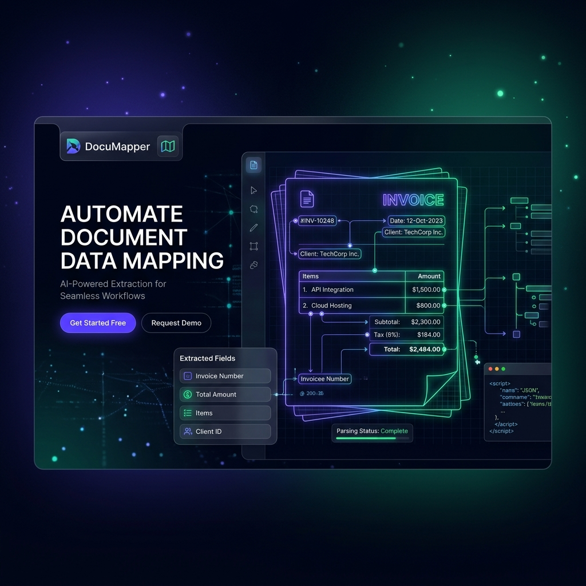

# DocuMapper

**DocuMapper** is a powerful, interactive visual utility designed to bridge the gap between unstructured document layouts and structured data extraction. By providing a clean interface over high-resolution document previews, it allows engineering, data entry, and implementation teams to visually map coordinates across templates—greatly speeding up the setup process for automated intelligent document processing or Jasper reporting schemas.

## Why DocuMapper?

When setting up automated pipelines for reading PDFs, invoices, forms, or legacy templates, developers often waste countless hours manually guessing pixel coordinates to slice data from pages.

DocuMapper completely automates this setup visually. You simply upload a sample document, draw boxes over the data fragments you care about, assign backend database columns to those boxes, and instantly output a robust, ready-to-use JSON Schema configuration map.

## Core Features

- 🎯 **Interactive Document Canvas**: Navigate through dense, large-scale documents with ease using smooth pan and zoom tools designed to mimic high-end design software.
- 📐 **Visual Mapping Engine**: Click and drag to create responsive mapping targets. Draw, resize, and reposition mapping boundaries globally with absolute percentage precision, making the mappings compatible with varied rendering resolutions.
- 🔒 **Schema Locking**: Guarantee precision by locking exact mapping coordinates to prevent accidental edits, saving work mid-flight.
- 💾 **Instant JSON Export/Import**: Download mapping results instantly as a clean JSON schema perfect for downstream pipelines. Need to hand the work off to another team? Forward the JSON and have them upload it back into their own DocuMapper dashboard to pick up exactly where you left off. 

## Who is this for?

- **Data Engineers** building OCR pipelines.
- **Jasper Reporting teams** designing new data generation layers.
- **Product Managers** defining strict parsing configurations for external forms.

---

> **Looking for development specifics?** Check out the [Technical Details Guide](technical_details.md) to dive into the React architectural makeup, environment setups, and build commands.
